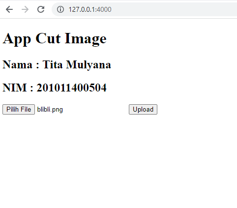
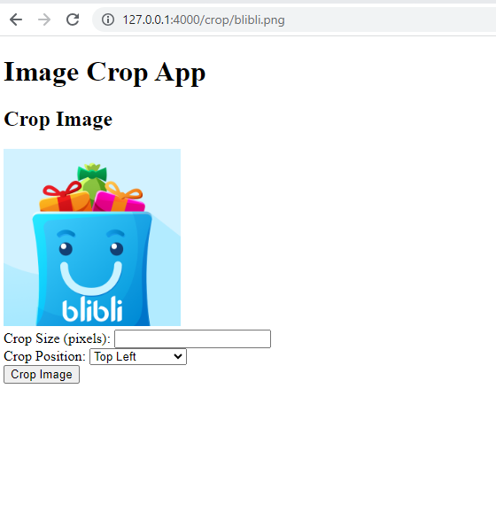
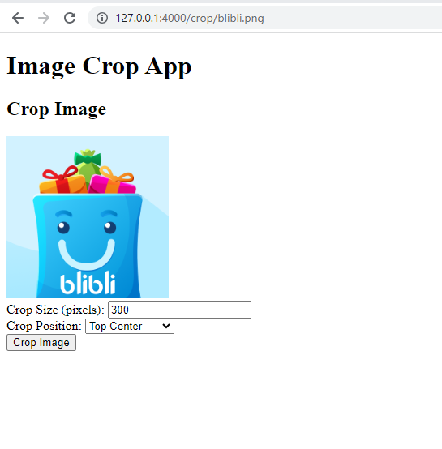
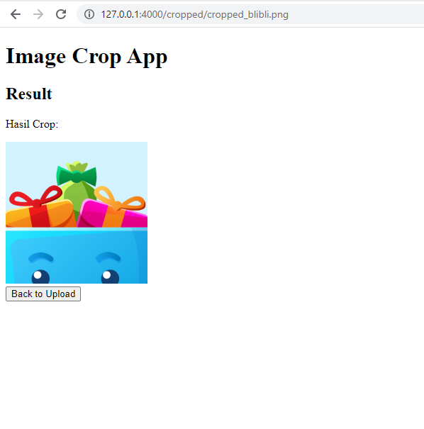

# Tugas Uas Komputer Grafik

Nama    : Tita Mulyana

NIM     : 201011400504

## Cara kerja Aplikasi Cut Image
Berikut adalah cara kerja aplikasi Cut Image:

### 1. Upload Gambar
Pertama-tama upload gambar dari halaman di atas.
Setelah itu pilih file gambar berupa .jpg atau .png lalu klik upload. sehingga gambar diupload dan dapat ditampilkan.

### 2. View Gambar
setelah klik tombol upload gambar akan di tampilkan.

### 3. Set ukuran Crop Gambar
lalu set size, dan plih posisi gambar yang akan di crop, contohnya `top_center` dan size nya 300

 
### 4. Output Gambar
Setelah klik tombol crop image maka akan menghasilkan result sesuai dengan ukuran yang di inginkan.

